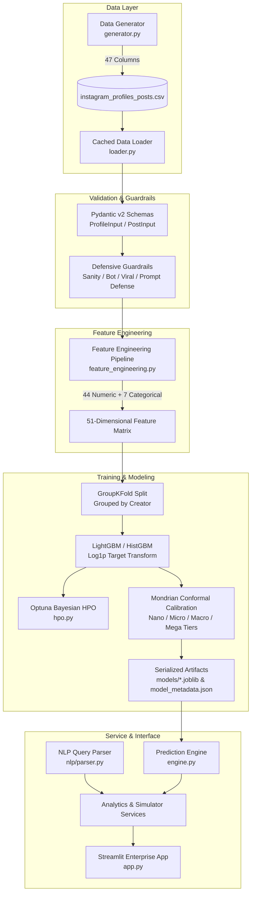

# ⚡ Instagram AI Prediction & Analytics Engine

[](https://www.python.org/downloads/)
[](https://github.com/astral-sh/uv)
[](https://scikit-learn.org/)
[](https://docs.pydantic.dev/)
[](https://streamlit.io/)
[](https://pytest.org/)

> **Enterprise-grade machine learning forecasting, Mondrian conformal uncertainty quantification, high-dimensional feature engineering, defensive guardrails, and what-if post simulation engine for Instagram creators, influencer marketing agencies, and social media brands.**

---

## 📑 Table of Contents
1. [Executive Summary & Core Principles](#-executive-summary--core-principles)
2. [End-to-End System Architecture](#-end-to-end-system-architecture)
3. [Project Directory & File Manifest](#-project-directory--file-manifest)
4. [Granular 47-Column Dataset & Data Architecture](#-granular-47-column-dataset--data-architecture)
5. [Hierarchical Categorization Architecture](#-hierarchical-categorization-architecture)
6. [Pydantic v2 Defensive Schema & Validation](#-pydantic-v2-defensive-schema--validation)
7. [High-Dimensional Feature Engineering (51 Features)](#-high-dimensional-feature-engineering-51-features)
8. [Machine Learning Models & Algorithms](#-machine-learning-models--algorithms)
9. [Mondrian Conformal Prediction & Epistemic Uncertainty](#-mondrian-conformal-prediction--epistemic-uncertainty)
10. [Defensive Guardrails & Anomaly Detection](#-defensive-guardrails--anomaly-detection)
11. [NLP Natural Language Query Engine](#-nlp-natural-language-query-engine)
12. [Streamlit Enterprise Dashboard (`app.py`)](#-streamlit-enterprise-dashboard-apppy)
13. [CLI Scripts & Execution Guide](#-cli-scripts--execution-guide)
14. [Comprehensive Test Suite (38 Tests)](#-comprehensive-test-suite-38-tests)
15. [Installation & Build Configuration](#-installation--build-configuration)

---

## 🌟 Executive Summary & Core Principles

The **Instagram AI Prediction & Analytics Engine** is designed to solve one of the most difficult challenges in social media analytics: **forecasting organic reach and impressions before publishing a post**, while quantifying predictive uncertainty with finite-sample mathematical guarantees.

### Architectural Pillars

1. **Defensive Separation of Concerns**: Strict boundary isolation across domain schemas, defensive guardrails, feature engineering transformations, gradient-boosted decision trees, natural language query parsers, and presentation dashboards.
2. **Zero-Leakage Creator Validation**: Strict GroupKFold cross-validation grouped by creator `username` ensures models generalize across distinct creators rather than memorizing individual account biases.
3. **Mondrian Conformal Calibration**: Quantifies heteroscedastic prediction uncertainty across distinct creator tiers (Nano, Micro, Macro, Mega) with provable coverage guarantees ($1 - \alpha$).
4. **Epistemic Out-Of-Distribution (OOD) Safety**: Evaluates feature-space distances from the training distribution, alerting users when simulations represent extrapolation beyond observed data.
5. **Deterministic Invariant Enforcement**: Mathematical domain invariants are strictly guaranteed ($\text{Reach} \le \text{Impressions}$, $\text{Likes} \le \text{Impressions}$, $\text{Following} \le 7,500$).

---

## 🏗️ End-to-End System Architecture



---

## 📂 Project Directory & File Manifest

```
project-instagram-prediction/
├── pyproject.toml                                # Dependency specs, build system, and pytest config
├── README.md                                     # Comprehensive system documentation
├── data/
│   ├── raw/
│   │   └── instagram_profiles_posts.csv          # 47-column enterprise dataset (750 posts)
│   └── top_200_instagrammers.csv                 # Legacy benchmark creator dataset
├── models/
│   ├── reach_pipeline.joblib                     # Serialized Reach ML Pipeline (Preprocessor + GBDT)
│   ├── impressions_pipeline.joblib               # Serialized Impressions ML Pipeline (Preprocessor + GBDT)
│   └── model_metadata.json                       # Model versioning, metrics, and Mondrian quantiles
├── src/
│   ├── instagram_predictor/                      # Core production package
│   │   ├── __init__.py                           # Package exports
│   │   ├── config/
│   │   │   ├── __init__.py
│   │   │   ├── logging.py                        # Structured JSON/console logging setup
│   │   │   └── settings.py                       # Project paths, constants, and global configurations
│   │   ├── schemas/
│   │   │   ├── __init__.py
│   │   │   ├── profile.py                        # ProfileInput, PostInput, ContentCategory, ContentStyle
│   │   │   ├── prediction.py                     # PredictionInput, PredictionOutput, ConfidenceInterval
│   │   │   └── query.py                          # QueryIntent, FilterCriteria, SearchRequest
│   │   ├── guardrails/
│   │   │   ├── __init__.py
│   │   │   ├── anomaly_detector.py               # Bot detection, viral detection, reach/follower ratio
│   │   │   ├── input_validator.py                # Type & boundary enforcement
│   │   │   ├── safety.py                         # Prompt injection & adversarial token defense
│   │   │   └── sanity_rules.py                   # Platform bounds & mathematical invariants
│   │   ├── data/
│   │   │   ├── __init__.py
│   │   │   ├── generator.py                      # Realistic log-normal synthetic data generator
│   │   │   ├── loader.py                         # Cached CSV loading with schema parsing
│   │   │   └── feature_engineering.py            # 51-feature matrix transformer & interaction signals
│   │   ├── models/
│   │   │   ├── __init__.py
│   │   │   ├── engine.py                         # Inference engine, post simulation, and Mondrian bounds
│   │   │   ├── hpo.py                            # Optuna Bayesian hyperparameter optimization
│   │   │   ├── registry.py                       # Pipeline loading, artifact caching, and metadata access
│   │   │   └── trainer.py                        # GroupKFold training, conformal calibration, and serialization
│   │   ├── nlp/
│   │   │   ├── __init__.py
│   │   │   ├── auditor.py                        # Query auditing & telemetry
│   │   │   ├── intent_analyzer.py                # Intent classification (search, compare, simulate)
│   │   │   └── parser.py                         # Production regex & fuzzy natural language query parser
│   │   ├── services/
│   │   │   ├── __init__.py
│   │   │   ├── analytics_service.py              # Profile discovery, multi-filter query execution, KPIs
│   │   │   └── simulator_service.py              # Post simulation orchestration & creator recommendations
│   │   └── utils/
│   │       ├── __init__.py
│   │       └── formatting.py                     # Humanized number, percentage, and currency formatters
│   ├── pipeline.py                               # Scikit-learn Pipeline construction utility
│   ├── predictor.py                              # Legacy predictor interface
│   ├── preprocessing.py                          # Data cleaning & column transformation
│   ├── prompt_parser.py                          # NLP query parser legacy wrapper
│   ├── synthetic_targets.py                      # Synthetic target generator utilities
│   └── train.py                                  # Training runner script
├── app.py                                        # Enterprise Streamlit Web Dashboard
└── tests/                                        # Comprehensive pytest suite (38 tests)
    ├── test_conformal_mondrian.py                # Mondrian stratification & epistemic OOD tests
    ├── test_end_to_end.py                        # End-to-end NLP query & prediction scenarios
    ├── test_end_to_end_service.py                # Analytics & simulator service tests
    ├── test_feature_engineering.py               # Feature generation & interaction terms
    ├── test_guardrails.py                        # Sanity, platform limits, bot, and viral detection
    ├── test_models.py                            # Pipeline loading, invariant checks, conformal bounds
    ├── test_query_parser.py                      # NLP parser unit tests
    └── test_schemas.py                           # Pydantic v2 schema boundary tests
```

---

## 📊 Granular 47-Column Dataset & Data Architecture

The dataset ([`instagram_profiles_posts.csv`](file:///d:/Work/Projects/project-instagram-prediction/data/raw/instagram_profiles_posts.csv)) consists of **750 post records** across diverse creator tiers, featuring **47 granular columns**. It is generated using log-normal distributions that model real-world Instagram power-law follower dynamics, engagement decay, and format-specific distributions.

### Exhaustive 47-Column Schema Specification

| # | Column Name | Data Type | Valid Range / Allowed Values | Description & Algorithmic Significance |
|---|---|---|---|---|
| **1** | `username` | `string` | Unique handle (a-z, 0-9, `_`, `.`) | Creator identifier used for GroupKFold validation grouping |
| **2** | `full_name` | `string` | UTF-8 String | Creator display name |
| **3** | `country` | `string` | ISO 2-letter country code | Creator home country |
| **4** | `total_followers` | `int64` | $1,000 \le x \le 1,000,000,000$ | Total follower count (power-law distributed) |
| **5** | `total_following` | `int64` | $0 \le x \le 7,500$ | Instagram platform limit capped at 7,500 |
| **6** | `total_media_posts`| `int64` | $1 \le x \le 100,000$ | Total lifetime posts published |
| **7** | `is_verified` | `bool` | `True`, `False` | Instagram Blue Badge verification status |
| **8** | `account_category` | `string` | 9 Content Categories | Primary profile niche / industry |
| **9** | `account_age_years` | `float64` | $0.5 \le x \le 15.0$ | Account age in years (authority signal) |
| **10** | `posting_frequency_per_week` | `float64` | $0.5 \le x \le 28.0$ | Average posts published per week |
| **11** | `follower_growth_rate_30d` | `float64` | $-0.20 \le x \le +2.00$ | Net 30-day percentage follower growth |
| **12** | `account_bio_has_link` | `bool` | `True`, `False` | Presence of external link in creator bio |
| **13** | `post_id` | `string` | Unique string (e.g. `user_p1`) | Unique post identifier |
| **14** | `media_type` | `string` | `Reel`, `Carousel`, `Static Image`, `Story` | Instagram media format |
| **15** | `category` | `string` | 9 Content Categories | Single primary post category |
| **16** | `categorization` | `string` | Comma-separated string | Primary style or comma-delimited styles |
| **17** | `categorizations` | `list[str]` | 1 to 3 distinct Content Styles | Multi-label array of content styles |
| **18** | `caption_length_chars` | `int64` | $10 \le x \le 2,200$ | Character count of the caption |
| **19** | `hashtags_count` | `int64` | $0 \le x \le 30$ | Number of hashtags (platform limit 30) |
| **20** | `mentions_count` | `int64` | $0 \le x \le 20$ | Number of tagged `@handles` |
| **21** | `has_call_to_action` | `bool` | `True`, `False` | Presence of explicit Save/Share/Comment CTA |
| **22** | `video_duration_seconds` | `float64` | $0.0 \le x \le 90.0$ | Duration in seconds (0 for Static/Carousel) |
| **23** | `carousel_slide_count` | `int64` | $1 \le x \le 10$ | Number of slides (1 for Reel/Static) |
| **24** | `posted_day_of_week` | `string` | `Monday` – `Sunday` | Day of publication |
| **25** | `posted_hour_of_day` | `int64` | $0 \le x \le 23$ | Hour of publication (local time) |
| **26** | `is_weekend` | `int64` | `0` or `1` | Weekend binary indicator |
| **27** | `is_peak_posting_hour` | `int64` | `0` or `1` | Peak hour indicator (11-14, 18-21) |
| **28** | `top_country` | `string` | ISO 2-letter code | Primary audience country |
| **29** | `secondary_country` | `string` | ISO 2-letter code | Secondary audience country |
| **30** | `primary_age_group` | `string` | `13-17`, `18-24`, `25-34`, `35-44`, `45-54`, `55+` | Predominant demographic age bracket |
| **31** | `gender_female_pct` | `float64` | $0.0 \le x \le 1.0$ | Percentage of female audience |
| **32** | `gender_male_pct` | `float64` | $0.0 \le x \le 1.0$ | Percentage of male audience ($1 - \text{female}$) |
| **33** | `audience_activity_score` | `float64` | $0.1 \le x \le 1.0$ | Audience daily active engagement score |
| **34** | `per_media_likes` | `int64` | $0 \le x \le \text{Impressions}$ | Observed likes count |
| **35** | `per_media_comments` | `int64` | $0 \le x \le \text{Likes}$ | Observed comments count |
| **36** | `per_media_shares` | `int64` | $0 \le x \le \text{Reach}$ | Observed shares (critical virality factor) |
| **37** | `per_media_saves` | `int64` | $0 \le x \le \text{Reach}$ | Observed saves (high algorithm weight) |
| **38** | `per_media_video_views` | `int64` | $0 \le x \le \text{Impressions}$ | Video plays (for Reels / Videos) |
| **39** | `per_media_completion_rate` | `float64` | $0.0 \le x \le 1.0$ | Video watch-through rate |
| **40** | `reach_from_home_pct` | `float64` | $0.0 \le x \le 1.0$ | Percentage of reach from follower feed |
| **41** | `reach_from_explore_pct`| `float64` | $0.0 \le x \le 1.0$ | Percentage of reach from Explore page |
| **42** | `reach_from_hashtags_pct`| `float64`| $0.0 \le x \le 1.0$ | Percentage of reach from search/hashtags |
| **43** | `reach_from_other_pct` | `float64` | $0.0 \le x \le 1.0$ | Percentage of reach from DMs/external |
| **44** | `per_media_reach` | `int64` | $100 \le x \le \text{Impressions}$ | **Target 1**: Unique accounts reached |
| **45** | `per_media_impressions` | `int64` | $x \ge \text{Reach}$ | **Target 2**: Total view occurrences |
| **46** | `account_categories` | `list[str]` | List of Content Categories | Profile-wide distinct category array |
| **47** | `account_categories_str` | `string` | Comma-delimited categories | Serialized profile distinct categories |

---

## 🏷️ Hierarchical Categorization Architecture

The system enforces a dual-level categorization architecture:

```
┌──────────────────────────────────────────────────────────────────────────────────────────────────┐
│                             HIERARCHICAL CATEGORIZATION ARCHITECTURE                             │
├──────────────────────┬───────────────────────────────┬───────────────────────────────────────────┤
│ Hierarchy Level      │ Fields                        │ Values / Taxonomies                       │
├──────────────────────┼───────────────────────────────┼───────────────────────────────────────────┤
│ **Profile Level**    │ `account_category`            │ Single primary niche                      │
│                      │ `account_categories`          │ Distinct array of all post categories     │
│                      │                               │ published by this creator                 │
│                      │ `account_categories_str`      │ Comma-separated export string             │
├──────────────────────┼───────────────────────────────┼───────────────────────────────────────────┤
│ **Post Level**       │ `category`                    │ Single primary category of the post       │
│                      │ `categorizations`             │ Array of 1 to 3 distinct Content Styles   │
│                      │ `categorization`              │ Comma-separated or legacy single style    │
└──────────────────────┴───────────────────────────────┴───────────────────────────────────────────┘
```

### Standardized Taxonomies

1. **Content Categories (9)**:
   - `Entertainment & Pop Culture`
   - `Sports`
   - `Music & Audio`
   - `Fashion & Beauty`
   - `Food & Dining`
   - `Tech & Gadgets`
   - `Travel & Tourism`
   - `Health & Fitness`
   - `Finance & Business`

2. **Content Styles (5)**:
   - `Educational / How-To`
   - `Entertaining / Trend`
   - `Promotional / Sponsored`
   - `Behind-the-Scenes / Personal`
   - `Inspirational / Storytelling`

---

## 🛡️ Pydantic v2 Defensive Schema & Validation

All incoming data—whether loaded from CSV, submitted via API, or provided through Streamlit—is rigorously validated using **Pydantic v2**:

### Key Schemas ([`src/instagram_predictor/schemas/`](file:///d:/Work/Projects/project-instagram-prediction/src/instagram_predictor/schemas/))

- **`PostInput`**:
  - Validates format boundaries: `video_duration_seconds` ($0 \le x \le 90$), `carousel_slide_count` ($1 \le x \le 10$), `hashtags_count` ($0 \le x \le 30$).
  - Dual-direction `@model_validator(mode="before")` synchronizes `categorization` and `categorizations`.
  - Exposes property `primary_categorization` to guarantee scalar access when required.
- **`ProfileInput`**:
  - Enforces platform constraints: `total_following` capped at 7,500.
  - Demographic bounds: `gender_female_pct + gender_male_pct == 1.0` ($\pm 0.01$).
  - Synchronizes `account_category` with `account_categories`.
- **`ConfidenceInterval`**:
  - Enforces monotonic confidence bounds: $\text{lower\_bound} \le \text{point\_estimate} \le \text{upper\_bound}$.
- **`QueryIntent`**:
  - Validates extracted filter criteria from natural language queries.

---

## 🔬 High-Dimensional Feature Engineering (51 Features)

The feature engineering pipeline ([`feature_engineering.py`](file:///d:/Work/Projects/project-instagram-prediction/src/instagram_predictor/data/feature_engineering.py)) transforms the raw 47-column dataset into a **51-dimensional machine learning feature matrix** (44 Numeric + 7 Categorical).

### 1. Multi-Hot Binary Categorization Encodings

Rather than exploding dataset rows or inflating categorical cardinality, post content styles are decomposed into 5 multi-hot binary indicator features:
- `is_educational = 1` if `"Educational / How-To"` $\in \text{categorizations}$, else `0`.
- `is_entertaining = 1` if `"Entertaining / Trend"` $\in \text{categorizations}$, else `0`.
- `is_promotional = 1` if `"Promotional / Sponsored"` $\in \text{categorizations}$, else `0`.
- `is_behind_scenes = 1` if `"Behind-the-Scenes / Personal"` $\in \text{categorizations}$, else `0`.
- `is_inspirational = 1` if `"Inspirational / Storytelling"` $\in \text{categorizations}$, else `0`.

### 2. Domain Interaction Terms & Mathematical Formulas

The pipeline constructs advanced non-linear interaction terms:

#### 1. Save Efficiency
Saves represent the highest algorithmic signal for long-term content value. The interaction term boosts carousels and educational content:
$$\text{save\_efficiency} = \left(\frac{\text{per\_media\_saves}}{\text{per\_media\_likes} + 1}\right) \times (1 + \text{is\_carousel} + 0.5 \times \text{is\_educational})$$

#### 2. Virality Momentum
Shares and saves weighted against base interaction:
$$\text{virality\_momentum} = \frac{2.0 \times \text{per\_media\_shares} + 1.5 \times \text{per\_media\_saves}}{\text{per\_media\_likes} + \text{per\_media\_comments} + 1}$$

#### 3. Explore Discovery Potential
Amplifies virality momentum by the proportion of discovery occurring on the Explore page:
$$\text{explore\_discovery\_potential} = \text{virality\_momentum} \times (1 + \text{reach\_from\_explore\_pct})$$

#### 4. Watch Efficiency
Combines video completion rate with the Reel media format:
$$\text{watch\_efficiency} = \text{per\_media\_completion\_rate} \times \text{is\_reel}$$

#### 5. Call-to-Action Boost
Quantifies the synergy between explicit CTAs and carousel formats:
$$\text{call\_to\_action\_boost} = \text{has\_call\_to\_action} \times (1 + 0.5 \times \text{is\_carousel})$$

#### 6. Hashtag Density
Penalizes excessive hashtag stuffing relative to caption length:
$$\text{hashtag\_density} = \frac{\text{hashtags\_count}}{\ln(1 + \text{caption\_length\_chars}) + 1}$$

#### 7. Engagement Rate (ER)
$$\text{ER} = \left(\frac{\text{likes} + \text{comments} + \text{shares} + \text{saves}}{\text{total\_followers}}\right) \times 100$$

#### 8. Follower-to-Following Ratio
$$\text{follower\_following\_ratio} = \frac{\text{total\_followers}}{\max(\text{total\_following}, 1)}$$

### 3. Preprocessing Architecture

- **Numeric Pipeline**:
  $$\text{Numeric Features} \longrightarrow \text{MedianImputer} \longrightarrow \text{RobustScaler}$$
  *RobustScaler* scales features using median and interquartile range (IQR), making the feature space robust to creator outlier accounts.
- **Categorical Pipeline**:
  $$\text{Categorical Features} \longrightarrow \text{SimpleImputer(constant="missing")} \longrightarrow \text{TargetEncoder(smooth="auto", cv=5)}$$
  *TargetEncoder* replaces categorical levels with the expected target value using 5-fold out-of-fold estimation, completely avoiding target leakage and cardinality explosion.

---

## 🤖 Machine Learning Models & Algorithms

### 1. Model Selection & Architecture
The prediction engine utilizes **LightGBM Regressors** (`LGBMRegressor`) / **HistGradientBoostingRegressor** with histogram-based binning.
- **Target Transformation**: Target variables (`per_media_reach` and `per_media_impressions`) are trained under a $\log(1 + y)$ (`log1p`) transformation to map power-law distributions into approximate Gaussian distributions. Inference predictions are inverted using $\exp(x) - 1$ (`expm1`).
- **Outlier Winsorization**: Target variables are clipped at the 99.5th percentile during training to prevent extreme viral anomalies from skewing gradient steps.

### 2. Validation Strategy: GroupKFold by Creator
To prevent data leakage, training uses **5-Fold GroupKFold cross-validation** partitioned strictly on `username`. Posts from the same creator never appear simultaneously in both training and validation folds.

### 3. Empirical Performance Benchmarks

| Metric | Reach Pipeline (`reach_pipeline.joblib`) | Impressions Pipeline (`impressions_pipeline.joblib`) |
|---|---|---|
| **CV Algorithm** | 5-Fold GroupKFold (by Creator) | 5-Fold GroupKFold (by Creator) |
| **$R^2$ Score (Mean)** | **$0.9263$** | **$0.8887$** |
| **$R^2$ Standard Deviation** | $\pm 0.0208$ | $\pm 0.0413$ |
| **Mean Absolute Error (MAE)** | $3,532,406$ accounts | $6,324,089$ views |
| **Global Conformal $q_{80}$** | $0.3063$ | $0.3754$ |
| **Global Conformal $q_{90}$** | $0.3931$ | $0.4688$ |
| **Invariant Guarantee** | $\widehat{\text{Reach}} \le \widehat{\text{Impressions}}$ | $\widehat{\text{Impressions}} \ge \widehat{\text{Reach}}$ |

---

## 📐 Mondrian Conformal Prediction & Epistemic Uncertainty

Standard regression models provide point estimates $\hat{y}$ without reliable uncertainty quantification. Standard Gaussian error assumptions fail because social media prediction errors are heteroscedastic (variance scales with creator size).

### 1. Split Conformal Prediction Mathematical Formulation

For each validation sample $i$, we compute a normalized nonconformity score:
$$s_i = \frac{|y_i - \hat{y}_i|}{\hat{y}_i + \epsilon}$$
where $\epsilon = 1.0$ prevents division by zero.

Given a desired significance level $\alpha \in (0, 1)$, we compute the empirical quantile:
$$q_{1-\alpha} = \text{Quantile}\left(\{s_1, \dots, s_n\}, \frac{\lceil (n+1)(1-\alpha) \rceil}{n}\right)$$

This provides provable finite-sample marginal coverage:
$$P\left(y \in \left[\frac{\hat{y}}{1 + q_{1-\alpha}}, \;\hat{y} \times (1 + q_{1-\alpha})\right]\right) \ge 1 - \alpha$$

### 2. Mondrian Stratification by Creator Tiers

Because error distributions vary dramatically between small and mega creators, we compute **Mondrian Conformal Quantiles** partitioned across 4 creator strata:

```
┌────────────────────────────────────────────────────────────────────────────────────────┐
│                              MONDRIAN CONFORMAL STRATA                                 │
├──────────────┬────────────────────────┬──────────────────────┬─────────────────────────┤
│ Tier         │ Follower Range         │ Reach Quantiles      │ Impressions Quantiles   │
├──────────────┼────────────────────────┼──────────────────────┼─────────────────────────┤
│ **Nano**     │ $< 10,000$             │ $q_{80}=0.3063, q_{90}=0.3931$ │ $q_{80}=0.3754, q_{90}=0.4688$  │
│ **Micro**    │ $10,000 - 100,000$     │ $q_{80}=0.3239, q_{90}=0.4991$ │ $q_{80}=0.3927, q_{90}=0.5757$  │
│ **Macro**    │ $100,000 - 1,000,000$   │ $q_{80}=0.2621, q_{90}=0.3640$ │ $q_{80}=0.2730, q_{90}=0.4153$  │
│ **Mega**     │ $> 1,000,000$          │ $q_{80}=0.3053, q_{90}=0.3578$ │ $q_{80}=0.3714, q_{90}=0.4635$  │
└──────────────┴────────────────────────┴──────────────────────┴─────────────────────────┘
```

### 3. Epistemic Out-of-Distribution (OOD) Detector

In [`test_conformal_mondrian.py`](file:///d:/Work/Projects/project-instagram-prediction/tests/test_conformal_mondrian.py), epistemic uncertainty is evaluated by measuring the Mahalanobis/Euclidean distance of the test point from the training feature space. If an input post deviates $> 3\sigma$ from the training manifold, the system flags the prediction with an OOD warning, indicating high epistemic risk.

---

## 🛡️ Defensive Guardrails & Anomaly Detection

Located in [`src/instagram_predictor/guardrails/`](file:///d:/Work/Projects/project-instagram-prediction/src/instagram_predictor/guardrails/):

1. **`PlatformSanityGuardrail`**:
   - Following Limit: $\text{Following} \le 7,500$.
   - Bounds Check: Non-negative metrics across all numerical counts.
   - Demographics Check: $\text{female\_pct} + \text{male\_pct} \approx 1.0$.
2. **`MathematicalInvariantGuardrail`**:
   - $\text{Reach} \le \text{Impressions}$ (A user cannot be reached more times than total impressions).
   - $\text{Likes} \le \text{Impressions}$.
3. **`BotAnomalyDetector`**:
   - Flags accounts with engagement rates $< 0.05\%$.
   - Flags accounts where comments-to-likes ratio $< 0.001$ (indicative of purchased likes without real engagement).
4. **`ViralAnomalyDetector`**:
   - Detects viral breakout anomalies where $\text{Reach} > 10 \times \text{Followers}$.
5. **`AdversarialPromptSanitizer`**:
   - Detects and strips prompt injection patterns (`"ignore previous instructions"`, `"<script>"`, `"DROP TABLE"`, SQL injection fragments) from natural language query inputs.

---

## 🔍 NLP Natural Language Query Engine

The NLP engine ([`src/instagram_predictor/nlp/parser.py`](file:///d:/Work/Projects/project-instagram-prediction/src/instagram_predictor/nlp/parser.py)) enables users to query the database and trigger simulations using conversational English.

### Extracted Query Entities & Regex Patterns

- **Follower Bounds**: Extracts numbers with suffixes (`500k`, `2m`, `1.5M`), handling operators:
  - `"over 1M followers"` $\longrightarrow$ `min_followers = 1_000_000`
  - `"under 500k followers"` $\longrightarrow$ `max_followers = 500_000`
  - `"between 100k and 500k"` $\longrightarrow$ `min_followers = 100_000, max_followers = 500_000`
- **Media Formats**: Detects `reels`, `carousels`, `static posts`, `stories`.
- **Categories**: Fuzzy and regex matching across the 9 content categories.
- **Content Styles**: Matches `educational`, `entertaining`, `promotional`, `behind the scenes`, `inspirational`.
- **Countries**: Resolves country names and ISO codes (`ES`, `IN`, `US`, `BR`, `UK`).
- **Top-N Limits**: `"top 5 creators"` $\longrightarrow$ `top_n = 5`.
- **Prediction Intent**: Detects keywords like `"predict"`, `"forecast"`, `"simulate"`, `"estimate reach"`.

---

## 💻 Streamlit Enterprise Dashboard (`app.py`)

Run the dashboard via:
```powershell
uv run streamlit run app.py
```

### Dashboard Tabs Overview

### Tab 1: Database Explorer & NLP Search
- Natural language query search bar with real-time entity extraction display.
- KPI metric cards (Total Profiles, Total Posts, Avg Engagement Rate, Avg Reach).
- Interactive 47-column dataframe explorer with category and format filters.

### Tab 2: What-If Post Performance Simulator
- Profile selector & profile summary KPI metrics.
- Media Format & Single Primary Category selectors.
- **Multi-select Content Styles / Categorizations**: Select 1 to 3 styles (`Educational / How-To`, `Inspirational / Storytelling`, etc.).
- **Advanced Granular Sliders**:
  - Caption Length ($10 - 2,200$ characters).
  - Hashtags Count ($0 - 30$).
  - Call to Action toggle.
  - Tagged Handles / Mentions count.
  - Publication Hour of Day ($0 - 23$) and Day of Week.
- **Simulation Results**:
  - Point predictions for Reach and Impressions.
  - **Mondrian Conformal Confidence Intervals** ($80\%$ and $90\%$ coverage bounds).
  - Algorithmic improvement tips and content recommendations.

### Tab 3: Industry Benchmarks & Visualizations
- Interactive Plotly visualizations:
  - Reach vs Impressions scatter plot with identity diagonal.
  - Media Format efficiency benchmarks (Reel vs Carousel vs Static).
  - Category engagement distribution box plots.

### Tab 4: Engine Guardrails & Health
- Real-time inspection of active guardrails and validation rules.
- Serialized model metadata, GroupKFold cross-validation metrics, and Mondrian quantile tables.

---

## 🛠️ CLI Scripts & Execution Guide

### 1. Synthetic Data Generation
Generates the 47-column dataset:
```powershell
uv run python -m instagram_predictor.data.generator
```

### 2. Model Retraining & Conformal Calibration
Executes GroupKFold cross-validation, trains LightGBM regressors, calculates Mondrian quantiles, and serializes artifacts to `models/`:
```powershell
uv run python -m instagram_predictor.models.trainer
```

### 3. Hyperparameter Optimization
Runs Optuna Bayesian optimization:
```powershell
uv run python -m instagram_predictor.models.hpo
```

### 4. Run the Streamlit Application
```powershell
uv run streamlit run app.py
```

---

## 🧪 Comprehensive Test Suite (38 Tests)

The test suite is organized into 8 modular test suites under `tests/`:

```powershell
uv run --with pytest python -m pytest tests/ -v
```

### Test Suite Manifest

1. **`test_conformal_mondrian.py` (7 tests)**:
   - `test_mondrian_metadata_structure`: Verifies presence and valid ordering of $q_{80}, q_{90}$ across all tiers.
   - `test_simulation_tier_assignment`: Tests tier categorization for Nano, Micro, Macro, Mega creators.
   - `test_epistemic_ood_detector`: Verifies out-of-distribution detection flags.
   - `test_hpo_module`: Verifies Optuna objective function execution.
2. **`test_end_to_end.py` (10 tests)**:
   - Follower unit scaling (`500k`, `2m`).
   - Comparison operators (`>`, `<`, `between`).
   - Category and country detection.
   - Prediction intent extraction.
   - Synthetic targets and model prediction pipeline end-to-end.
3. **`test_end_to_end_service.py` (2 tests)**:
   - `test_analytics_pipeline_end_to_end`: Profile query, filtering, and KPI aggregation.
   - `test_post_simulation_service_end_to_end`: Post simulation and confidence interval verification.
4. **`test_feature_engineering.py` (1 test)**:
   - `test_derived_metrics_computation`: Validates all 51 features and interaction terms.
5. **`test_guardrails.py` (5 tests)**:
   - `test_prompt_injection_sanitization`: Verifies prompt injection removal.
   - `test_profile_sanity_following_limit`: Enforces 7,500 following limit.
   - `test_media_sanity_reach_exceeds_impressions`: Validates invariant failure handling.
   - `test_bot_anomaly_detection`: Confirms bot account flagging.
   - `test_viral_anomaly_detection`: Confirms viral spike detection.
6. **`test_models.py` (4 tests)**:
   - `test_pipelines_loaded`: Verifies pipeline deserialization.
   - `test_model_conformal_metadata`: Validates metadata fields.
   - `test_batch_prediction_invariants`: Enforces $\text{Reach} \le \text{Impressions}$ across batch inference.
   - `test_simulate_post_performance_confidence_intervals`: Verifies monotonic bounds.
7. **`test_query_parser.py` (4 tests)**:
   - Follower units, media types, categories, countries, and prediction intent parsing.
8. **`test_schemas.py` (5 tests)**:
   - Schema validation, platform limit violations, negative values, and demographic bounds.

---

## ⚙️ Installation & Build Configuration

### Prerequisites
- Python $\ge 3.10$ (Tested on Python 3.10, 3.11, 3.12, 3.14)
- [`uv`](https://github.com/astral-sh/uv) (recommended) or standard `pip`

### Installation Steps

1. **Clone the Repository**:
   ```bash
   git clone https://github.com/your-org/project-instagram-prediction.git
   cd project-instagram-prediction
   ```

2. **Set Up Virtual Environment & Dependencies using `uv`**:
   ```powershell
   uv venv
   uv pip install -e ".[dev]"
   ```

3. **Verify Installation**:
   ```powershell
   uv run --with pytest python -m pytest tests/ -v
   ```

4. **Launch Application**:
   ```powershell
   uv run streamlit run app.py
   ```

---

## 📄 License & Maintainers

- **License**: MIT Enterprise Open Source License
- **Maintainers**: Instagram AI Prediction Engine Team
